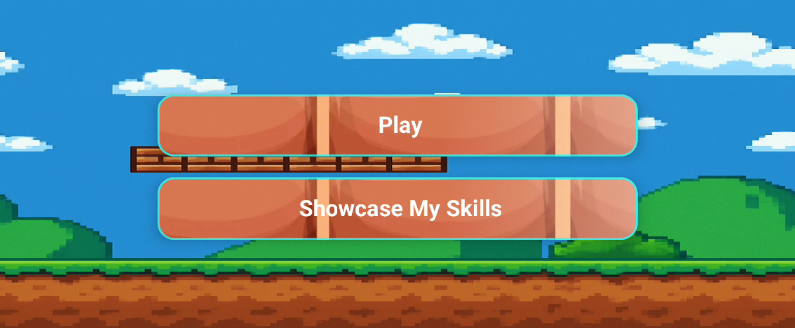
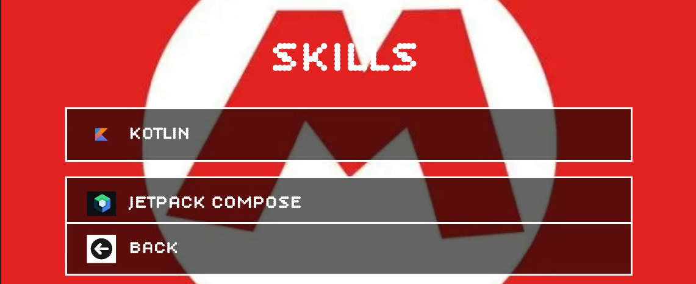
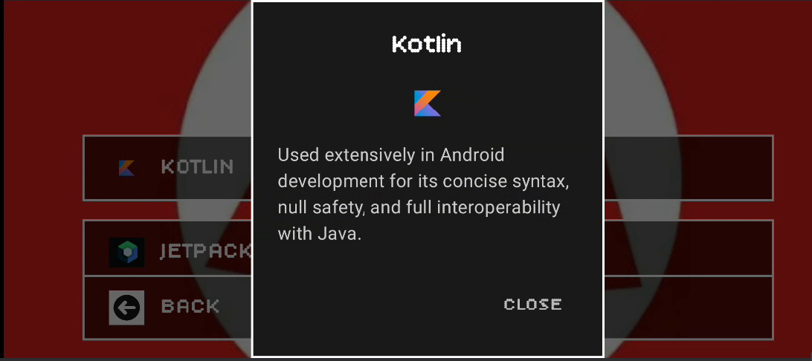
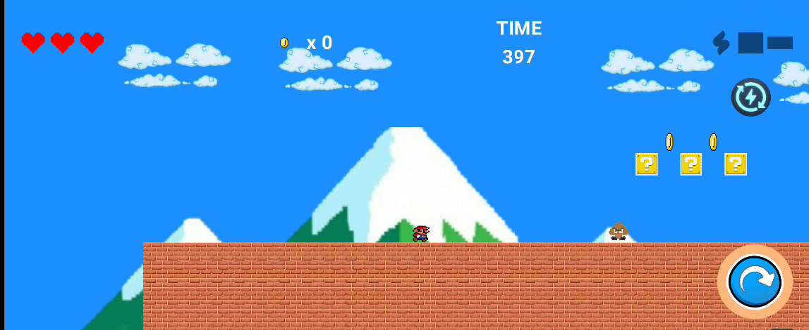
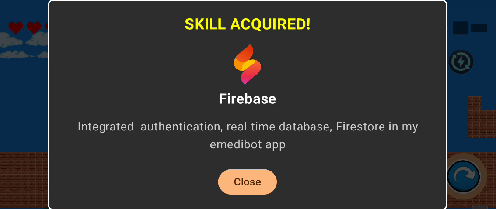

# 🎮 Pixelpholio — A Gamified Android Developer Portfolio


Pixelpholio is a **2D platformer built entirely using Jetpack Compose + Canvas**, where each collectible unlocks a *real* developer skill. It's not just a game — it's an interactive portfolio that lets you play through my experience as an Android developer.

---

## 📸 Screenshots

| Start Screen | Skills Menu | Kotlin Skill Modal |
|--------------|-------------|---------------------|
|  |  |  |

| Gameplay | Skill Acquired Dialog |
|----------|------------------------|
|  |  |

## 🎥 Gameplay Demo


## 🎯 Features

- 🕹️ **Joystick Controls**: Built from scratch using Compose's Canvas API
- 💡 **Gamified Skill Unlocks**: Collect in-game mushrooms to unlock real tech skills
- 🎨 **Retro Art & UI**: Pixel-style backgrounds, dialogs, and animated sprites
- 🧠 **Custom Skill Modals**: Clickable dialogs show off tools like Kotlin, Firebase, Jetpack Compose, etc.
- 💥 **Sound Effects**: Feedback-rich audio with jump and collect actions
- ❤️ **Hearts, Coins, and Enemies**: Health system, collectibles, and Goomba-style enemies
- ⚡ **Skill Showcase Screen**: Explore the dev's toolbox from a retro Mario-style menu

---

## 🛠 Built With

- **Kotlin**
- **Jetpack Compose**
- **Canvas API** for pixel-perfect rendering
- **SoundPool** for audio
- **Custom physics and collision engine**
- **Jetpack Lifecycle**, `ViewModel`, and state management

---

## 🚀 Getting Started

### Clone the Repo:
```bash
git clone https://github.com/rookiecoder910/pixelpholio.git
cd pixelpholio
```

### Build and Run:
```bash
./gradlew assembleDebug
```

---

## 🌟 GSSoC (Girl Script Summer of Code) Contributions

We're excited to participate in **Girl Script Summer of Code 2024**! This section tracks all GSSoC-related issues and contribution opportunities.

### 📋 GSSoC Issue Tracker

#### 🟢 Beginner-Friendly Issues
<!-- Issues suitable for first-time contributors -->
*No beginner issues currently available. Check back soon!*

#### 🟡 Intermediate Issues  
<!-- Issues requiring some Android/Kotlin experience -->
*No intermediate issues currently available. Check back soon!*

#### 🔴 Advanced Issues
<!-- Complex issues for experienced contributors -->
*No advanced issues currently available. Check back soon!*

### 🏷️ GSSoC Labels Guide

When contributing to GSSoC issues, look for these labels:
- `gssoc` - Issues specifically for GSSoC participants
- `good-first-issue` - Perfect for newcomers
- `help-wanted` - Community assistance needed
- `documentation` - Documentation improvements
- `bug` - Bug fixes needed
- `enhancement` - New feature requests
- `ui/ux` - User interface improvements
- `game-mechanics` - Core game functionality

### 🤝 How to Contribute

1. **Fork** this repository
2. **Browse** the GSSoC issues listed above
3. **Comment** on an issue you'd like to work on
4. **Wait** for assignment from maintainers
5. **Create** a new branch for your feature
6. **Make** your changes following our coding standards
7. **Test** your changes thoroughly
8. **Submit** a pull request with a clear description

### 📊 GSSoC Statistics

- **Total GSSoC Issues**: 0
- **Completed Issues**: 0
- **Active Contributors**: 0
- **Open Issues**: 0

### 🎯 Contribution Areas

We welcome contributions in these areas:
- 🎮 **Game Mechanics**: Physics, collision detection, player controls
- 🎨 **UI/UX Design**: Pixel art, animations, user interface
- 🔊 **Audio System**: Sound effects, background music
- 📱 **Android Features**: Performance optimization, compatibility
- 📚 **Documentation**: Code comments, user guides, tutorials
- 🧪 **Testing**: Unit tests, integration tests, bug fixes

### 📞 Get Help

- Create an issue for questions
- Join our community discussions
- Tag maintainers in your pull requests
- Read the [GSSoC Monitoring Documentation](docs/GSSOC_MONITORING.md) for technical details

### 🔧 System Maintenance

The GSSoC issue list is automatically updated by:
- **GitHub Actions**: Runs on issue changes and daily at 9 AM UTC
- **Manual Updates**: Run `./scripts/update-gssoc.sh` to update manually
- **API Integration**: Fetches real-time data from GitHub Issues API

---

## 🤝 Contributing

Please read our [contributing guidelines](CONTRIBUTING.md) before submitting any pull requests.

## 📄 License

This project is licensed under the MIT License - see the [LICENSE](LICENSE) file for details.
